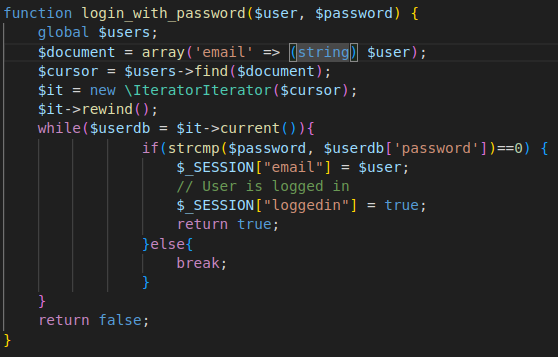
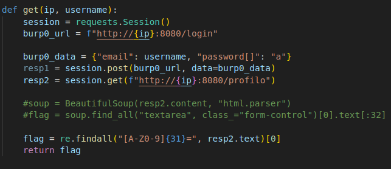
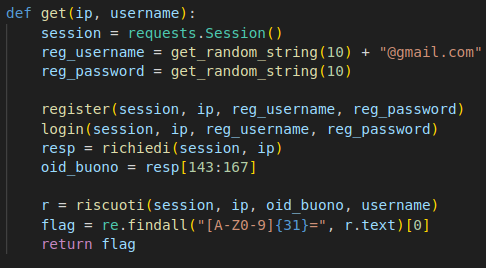
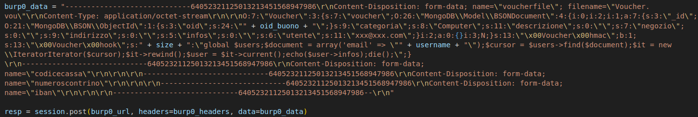
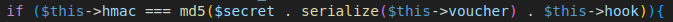
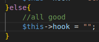

# Simulazione 0

Prima simulazione in formato Attack/Defense svolta il 19 e 20 maggio per l'addestramento previsto dal percorso CyberChallengeIT.

I servizi qui proposti erano:
* ilBonus
* WAQS

## ilBonus
_Categoria: web_

ilBonus è un'applicazione web sviluppata con PHP che permette agli utenti di registrarsi per richiedere dei bonus sotto forma di voucher. Questi possono poi essere verificati e riscossi.

### Vulnerabilità 1 - Loose Comparison in Login

Questo servizio soffre di una vulnerabilità comune di PHP, ovvero l'utilizzo di una loose comparison. In particolare, la password inserita dall'utente viene confrontata con la password dell'utente memorizzata nel DB attraverso l'uso della funzione built-in _strcmp_. Tuttavia, si confronta il risultato della strcmp con 0 (password uguali) attraverso un == (loose comparison) e non attraverso un === (strict comparison). 

Individuato ciò, basta fare in modo che la strcmp restituisca NULL, poiché per la versione di PHP utilizzata, NULL == 0 è True. Per avere NULL come risultato di strcmp, basta semplicemente passare come password un array.

#### Exploit

A questo punto l'exploit è molto breve. Basta sfruttare gli username presenti come flagIds e fare il login per questi account sfruttando la vulnerabilità indicata. In seguito la flag si trova in */profilo* nella sezione "Ulteriori informazioni".

Come possiamo notare per passare un array è stato necessario passare "password[]=\<password\>" anziché "password=\<password\>"

#### Patch

La patch è molto semplice: basta sostituire la loose comparison con una strict comparison, andando a modificare il "==" in "===".

### Vulnerabilità 2 - Deserialization Attack, Loose Comparison

I voucher richiesti vengono serializzati e deserializzati. Inoltre, la classe Voucher presenta il metodo magico __wakeup, che verrà eseguito quando si deserializza un oggetto Voucher, andando ad eseguire il codice presente all'interno dell'hook. Possiamo notare che per poter inserire del codice hook arbitrario è necessario superare il controllo sull'HMAC e inserire un id di un voucher valido. Tuttavia, il controllo sull'HMAC viene fatto nuovamente con una semplice loose comparison che, per la versione PHP utilizzata dall'applicazione, permette di confrontare con successo troppe cose. 

Per esempio, passando un HMAC come valore booleano a true è possibile superare sempre la condizione perché si va ad effettuare il seguente controllo: "string" == TRUE, e questo è sempre vero in quanto equivale a verificare se la stringa è impostata o meno.

#### Exploit

Per poter sfruttare tale vulnerabilità, bisogna effettuare una serie di passaggi. In particolare, bisogna:
1. Registrarsi;
2. Loggarsi;
3. Richiedere un voucher;
4. Riscuotere il voucher richiesto.

La riscossione è proprio il passaggio più importante perché permette riscuotere un buono inserendo, però, delle informazioni che ci permettono di bypassare il controllo sull'HMAC e di inserire del codice malevolo per avere una RCE:

Come possiamo vedere qui è stato inserito codice PHP in hook. Esso prevede, innanzitutto, di effettuare una query al DB (mongoDB) andando a recuperare l'utente in base all'email specificata (flagId). Successivamente si vanno a prendere le info dell'utente e, come prima, troviamo la flag in "Ulteriori informazioni".

#### Patch

Il modo più veloce per patchare questa vulnerabilità è stato quello di andare a sostituire la loose comparison con una strict comparison nel confronto tra HMAC:

Inoltre, qualora tutti i controlli andassero a buon fine, l'hook viene impostato a "", per fare in modo che, se qualcuno trovi altri modi per bypassare le verifiche e impostare l'hook in questo modo, esso venga automaticamente cancellato.

## WAQS
_Categoria: pwn_