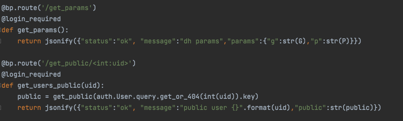
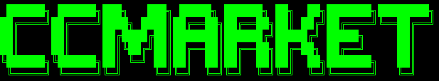
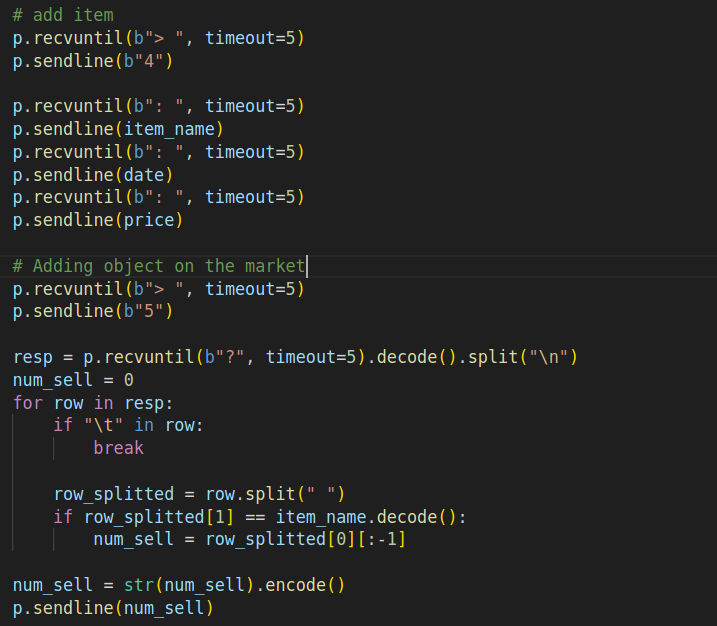
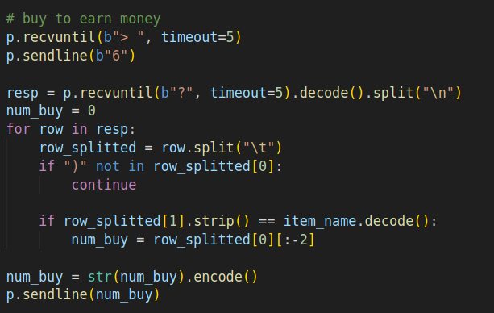
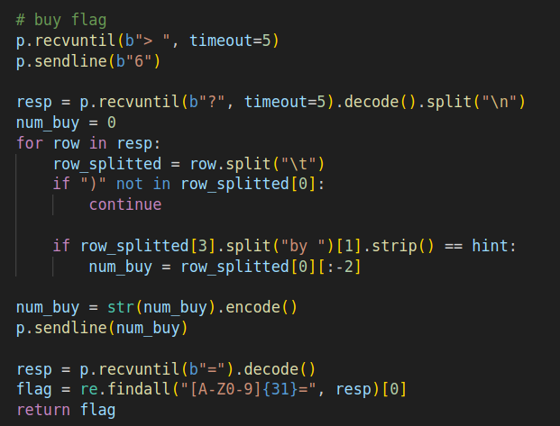
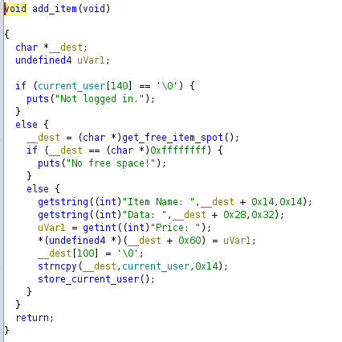

## MOOZ

Mooz è una piattaforma per lo scambio di messaggi. 
Un utente può:
* Registrarsi
* Effettuare il login
* Inviare/Ricevere un messaggio
* Visualizzare i messaggi inviati (anche relativamente ad un solo utente)

### Exploit 

La flag da trovare era nascosta in un messaggio cifrato inviato da un utente A ad un utente B (entrambi ricavabili da flagIds).
La piattaforma, però, permetteva di ricavare il messaggio tramite un identificativo. Il messaggio era cifrato utilizzando DES.
La vulnerabilità consiste nel non aver nascosto a dovere i dati per la generazione delle chiavi degli utenti per cui, risolvendo il problema del logaritmo discreto e compiendo qualche operazione complementare, si è riusciti a calcolare la chiave di sessione e decifrare il messaggio.

### Patch

La patch trovata prevedeva di inserire un valore errato molto alto in /get_public. In questo modo, non solo non si esponevano informazioni importanti, ma si potevano anche far bloccare gli script avversari più deboli.

## CCMarket

CCMarket è una challenge di pwn. In CCmarket dopo aver fatto l'accesso si ha disposizione una quota di soldi per acquistare oggetti e si può scegliere se accettare gli oggetti sul mercato oppure se creare oggetti da mettere sul mercato. Se acquistiamo gli oggetti forniti nei flagID si ottengono le flag, ovviamente non abbiamo a disposizione abbastanza soldi per acquistare i flagID, dato che il loro prezzo è MAX_INT di C. 

### Vulnerabilità - Si può generare un prezzo negativo
Il problema è che CCMArket da la possibilità di aggiungere sul mercato oggetti che hanno un prezzo negativo. Ci da la possibilità ce quando acquistiamo un oggetto otteniamo soldi invece che perderne.

Viene illustrato l'exploit.

In questa prima fase si interagisce con il servizio, facendo una registrazione di un utente e facendo il login.

Nella seconda fase si aggiunge l'oggetto con prezzo -MAX_INT sul mercato.

Nella terza fase compriamo l'oggetto con prezzo negativo

Nella quarta ed ultima fase compriamo l'oggetto con dentro la flag e ne analizziamo il contenuto per ottenere la flag.

### Patch
Una patch che era possibile implementare era quella di verificare che un oggetto da immettere sul mercato potesse avere solo un prezzo positivo. Modificando questa funzione:

Andando a modificare la funzione **strncpy** con il metodo del PRELOADING e inserendo all'interno della funzione una verifica sul prezzo. Questo metodo non era però noto al tempo della simulazione quindi non si è riusciti a patchare.

