# Simulazione 2

Seconda simulazione in formato Attack/Defense svolta il 15 e 16 giugno per l'addestramento previsto dal percorso CyberChallengeIT.

I servizi qui proposti erano:
* CApp
* CC_Manager
* FIXME
* TiCCket

## FIXME
_Categoria: web_

FIXME è una challenge web. Essa mette a disposizione solo un backend col quale interagire, senza frontend.

### Vulnerabilità 1 - Sensitive data exposure

La prima vulnerabilità è molto semplice. L'applicazione forniva un endpoint "/api/products" che forniva informazioni relative ai prodotti. Tuttavia, veniva anche esposto un dato sensibile "secret", in cui era presente la flag (da notare che la challenge stessa dava un hint dicendo che bisognava mostrare solo nome e prezzo dei prodotti).

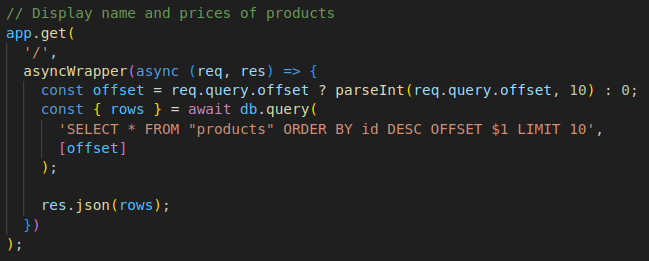

#### Exploit

L'exploit, di conseguenza, è stato anche molto semplice. Bastava fare una richiesta all'endpoint citato da cui si riceveva una lista di oggetti json. A quel punto la flag si trovava nel secret dei prodotti i cui id erano indicati cme flagIds dal gameserver.

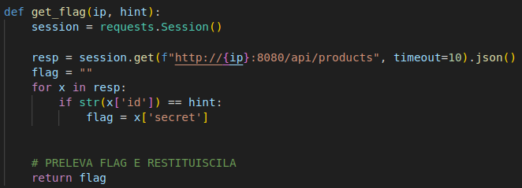

#### Patch

Anche la patch non ha richiesto molti sforzi. È bastato modificare la query che prelevava i prodotti che venivano mostrati andando a prelevare tutti i campi tranne il secret.

### Vulnerabilità 2 - Price Injection

Un'altra vulnerabilità di questo servizio permetteva di vedere un prodotto anche se non si avevano abbastanza monete per poterlo fare. Ciò era possibile, in quanto nella richiesta POST da fare all'endpoint "/api/products/view" si poteva inserire anche il prezzo del prodotto e le monete dell'utente venivano confrontate con questo prezzo.

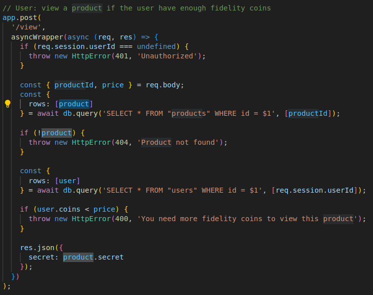

#### Exploit

L'exploit dunque prevedeva di registrare un utente e visitare questo endpoint, inserendo come prezzo, ad esempio, 1, in quanto un utente appena registrato aveva a disposizione 10 monete.

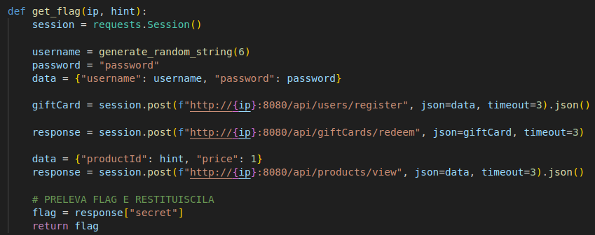

#### Patch

La patch prevedeva semplicemente di utilizzare il prezzo del prodotto recuperato tramite la query, anziché il prezzo inserito dall'utente.

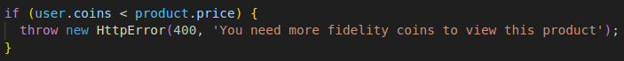

## TiCCket 
_Categoria: pwn_

TiCCket è una challenge della categoria pwn. E' un servizio
fornito tramite un server scritto in C. Il server permette di creare delle CTF o di caricarne alcune già esistenti. Ogni ctf ha dei ticket al suo interno. L'obbiettivo è caricare la ctf con il nome del flagID e leggere il contenuto del ticket con indice 0 della CTF. Normalmente l'accesso ai ticket di una CTF è consentito solo all'admin di quella CTF che ha un token associato.
Ma si possono sfruttare le vulnerabilità per fingersi l'admin.

### Vulnerabilità - 1 Carattere letto in più 
La vulnerabilità si trova all'interno di questa funzione: 

Il problema è in questa riga:

Dato che il **g_admin_token** è in realtà lungo 17 char, si fa un BSS overflow andando a sovrascrivere la variabile globale **g_is_restricted** cambiandogli valore con un valore che sarà interpretato come false, dato che questa variabile se è messa a true indica che non si è un admin, se è messa a false indica che si è un admin.

Il codice dell'exploit è così semplice da comprendere, oltre a tutte le operazioni da fare per navigare all'interno del menù, la riga seguente esegue il BSS overflow dato che passa 20 caratteri invece che 17:

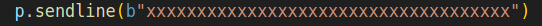

Il codice completo:

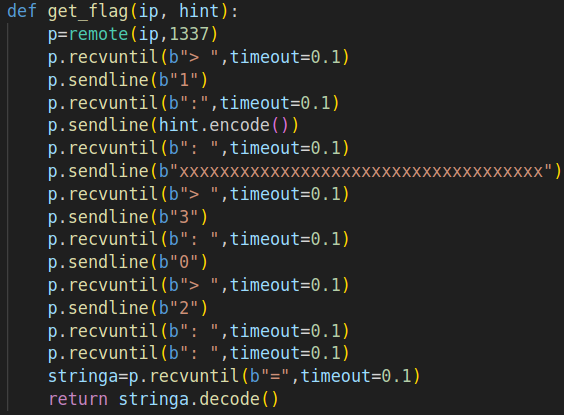

### Patch

Per patchare basta cambiare con Ghidra il valore 18 con 17 così che non si permetta più il BSS overflow.

## CApp
_Categoria: web, misc_

CApp è un'applicazione web di hosting che offre un sistema operativo chiamato ccOS basato su una singola classe Python. Esso inoltre, forniva una finestra di terminale che faceva eseguire solo alcuni comandi (per esempio: ls, cat, ...)

### Vulnerabilità - Path Traversal

Qui il problema individuato, consisteva nel fatto che era possibile accedere a volumi creati da altri utenti tramite path traversal. Nella cartella ".union.", infatti, erano presenti i volumi di tutti gli utenti. In questo modo bastava semplicemente accedere ai volumi degli utenti indicati dal gameserver, leggere i all'interno dei file lì presenti e stampare la flag quando trovata. 

#### Exploit

Come già detto, l'obiettivo era individuare quale tra i file presenti nei volumi degli utenti indicati dal gameserver aveva la flag. L'exploit dunque era diviso come segue.

Inizialmente si registrava un utente:

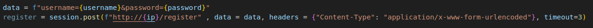

Successivamente si listavano i file presenti nel volume dell'utente considerato (flagId):

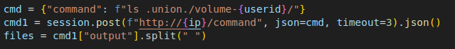

Infine, si scorrevano tutti questi file finché non si trovava la flag all'interno di uno di questi:

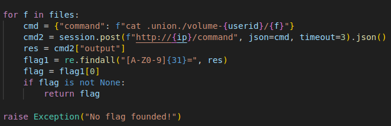

#### Patch

Il problema dunque, risiedeva nel mounting del file system. Esso doveva essere montato ad un livello inferiore rispetto alla cartella .union.

## CC-Manager
_Categoria: crypto_

CC-Manager è una challenge crypto che funge da password manager. Permette quindi di registrarsi, loggarsi, memorizzare le proprie password, condividerle con altri utenti, ecc.

### Vulnerabilità - Unsafe Function

La vulnerabilità individuata in questo servizio è relativa all'uso della funzione _getPrime_. In particolare, si ha che quando un utente si registra, gli viene fornito un recovery token per il recupero della password. Se riuscissimo quindi a fare una predizione su questo token, potremmo recuperare la password di un utente e accedere al suo profilo. 

Quando un utente si registra gli viene fornito il recovery token che viene generato a partire dallo username. Per generare questo token vengono generati due numeri primi random a 768 bit.

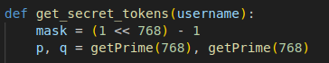

Il problema però risiede nella funzione getPrime con la quale si generano questi numeri. Essa infatti non genera dei numeri primi realmente casuali. Infatti, è stato possibile notare che il token relativo ad uno username variava sempre in 3 (o al max 4) possibili scelte. Questo proprio perché venivano scelti sempre gli stessi numeri primi.

#### Exploit

A questo punto quindi, l'idea per l'exploit è stata di calcolare da sè il possibile recovery token di uno username e sfruttarlo. Inizialmente era stato previsto un ciclo per fare in modo che si ripetesse questo calcolo finché non si trovava il token corretto. Tuttavia, è stato notato che questo, anche con l'uso dei thread, rallentava molto l'exploit. Per cui è stato scelto di fare il calcolo del token una sola volta. Ciò permetteva comunque di catturare molte flag. Di seguito la spiegazione dell'exploit.

Inizialmente, si calcolava il recovery token per lo username dato dal flagId.

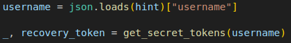

Successivamente si provava a utilizzare questo token per recuperare la password dell'utente.

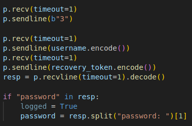

Recuperata questa, si faceva il login.

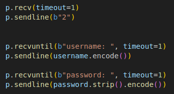

Infine, la flag era una delle password memorizzate da quell'utente.

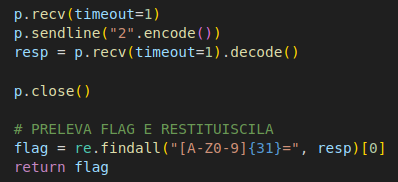

#### Patch

La patch attuata consisteva semplicemente nel cifrare il token generato dalla funzione _get\_secret\_token_. Questa idea permetteva di bloccare tutti quegli attacchi che, come noi, andavano a precalcolare il token.

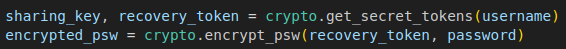

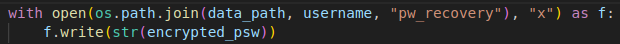

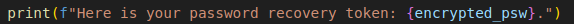