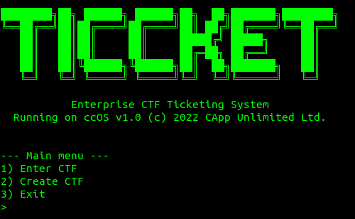
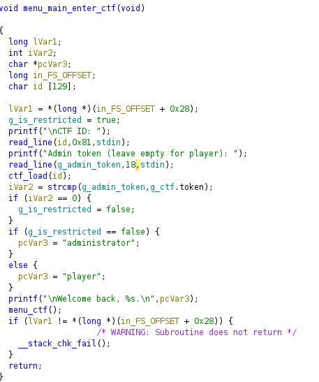
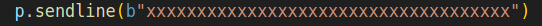
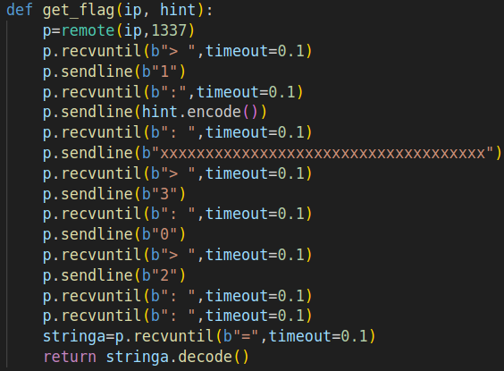

## TiCCket 

TiCCket è una sfidata della categoria pwn. E' un servizio
fornito tramite un server scritto in C. Il server permette di creare delle CTF o di caricarne alcune già esistenti. Ogni ctf ha dei ticket al suo interno. L'obbiettivo è caricare la ctf con il nome del flagID e leggere il contenuto del ticket con indice 0 della CTF. Normalmente l'accesso ai ticket di una CTF è consentito solo all'admin di quella CTF che ha un token associato.
Ma si possono sfruttare le vulnerabilità per fingersi l'admin.

### Vulnerabilità 1- Carattere letto in più 
La vulnerabilità si trova all'interno di questa funzione: 

Il problema è in questa riga:

Dato che il **g_admin_token** è in realtà lungo 17 char, si fa un BSS overflow andando a sovrascrivere la variabile globale **g_is_restricted** cambiandogli valore con un valore che sarà interpretato come false, dato che questa variabile se è messa a true indica che non si è un admin, se è messa a false indica che si è un admin.

Il codice dell'exploit è così semplice da comprendere, oltre a tutte le operazioni da fare per navigare all'interno del menù, la riga seguente esegue il BSS overflow dato che passa 20 caretteri invece che 17:

Il codice completo:

### Patch

Per patchare basta cambiare con Ghidra il valore 18 con 17 così che non si permetta più il BSS overflow.

