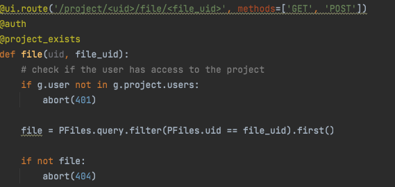

## SaaS

Saas è una piattaforma per lo storage di progetti e di dati.
Essa permette all'utente di:
* registrarsi
* fare il login
* creare un progetto
* caricare un file in un progetto
* recuperare un progetto

### Exploit
La flag era contentuta in un file caricato da un utente sconosciuto.
Per recuperare la flag bisognava capire quale utente avesse caricato il file, effettuare il login e, infine, scaricare il file stesso.
Per effettuare il login impersonificando un altro utente era sufficiente allegare alla propria richiesta un cookie flask di sessione che certificasse il login. Tramite i pcap ci siamo resi conto che il valore all'interno del cookie che garantiva il login era sempre lo stesso. Inserendo questo valore nel nostro cookie quindi, potevamo effettuare l'accesso impersonificando qualsiasi utente. 
Per individuare l'owner del file di nostro interesse abbiamo usato il metodo _file_ che restituiva 401 se il file non apparteneva all'utente che lo richiedeva.

Avendo da flagIds l'identificativo del file di nostro interesse, è bastato un bruteforce sugli utenti per capire il suo creatore.

A questo punto è bastato scaricare il file e inviare la flag

